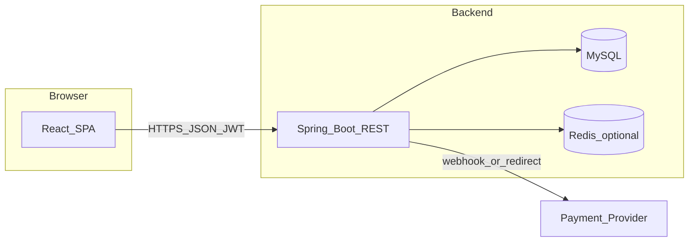

# 外贸网站：React + Kotlin 前后端分离方案

## 已决产品策略：匿名购物车

- **未登录可加购**：浏览器侧持有 **匿名购物车标识**（由后端签发或可验证的 `cartId`，配合 **HttpOnly Cookie** 或首响应下发后前端每次请求携带），所有加购/改数量走「匿名购物车」API。
- **登录后合并**（建议后续迭代，MVP 可简化）：用户登录时把匿名 `cartId` 与用户账号合并，避免丢车。
- **结账**：下单必须绑定 **可联系身份**——常见两种：**登录用户下单**，或 **游客结账**（邮箱/电话 + 条款同意）。纯匿名不付款的「无身份订单」不利于售后与风控，一般不推荐作为唯一路径。

## 目标与范围

- **前端**：React（建议 **Vite + TypeScript + React Router**），面向买家的 **B2B/B2C 展示与下单**，以及可选的 **简易后台**（商品/订单管理）或单独 admin 应用。
- **后端**：**Kotlin + Spring Boot 3**（生态成熟，适合订单、支付回调、事务与权限；若你更偏好轻量框架可改为 Ktor，但电商场景 Spring 更省事）。
- **数据层**：**SQL 优先**——默认 **MySQL 8（或兼容的云托管 MySQL）**，库/表/连接统一 **utf8mb4**（外贸多语言与中文）；结构变更用 **Flyway**（或 Liquibase）版本化；持久化可用 **Spring Data JPA**（或 JDBC/MyBatis 若你更想手写 SQL），与「SQL 库」不矛盾。
- **容器**：开发与 CI 以 **Docker** 为基准——`docker-compose` 拉起 **MySQL**（必选）、**Redis**（可选，会话/限流）、后续可加后端镜像；本机也可直接跑 JVM，但库依赖容器，避免「每人装一套 MySQL」。
- **MVP 能力**：商品浏览、**匿名购物车**、下单、支付（先接 **一种** 支付渠道即可，如 Stripe 国际卡或你目标市场常用的方式）。

## 推荐仓库结构

单仓 monorepo 便于联调，也可拆成两仓：

```
globuy/
  frontend/          # Vite React TS
  backend/           # Kotlin Spring Boot (Gradle)
  docker-compose.yml # MySQL（必选）+ Redis（可选）；后端可本地 gradle 或同 compose 构建
  # 可选: backend/Dockerfile 用于镜像化 API
```

## 架构示意



## 后端（Kotlin）要点

- **模块划分**：`auth`（注册/登录/JWT）、`catalog`（商品/SKU）、`cart`（**匿名 cart + 可选 userId**）、`order`、`payment`（创建支付意图、处理 webhook）、`admin`（可选）。
- **匿名购物车数据**：表 `cart` / `cart_line` 与 `cart_id`（UUID）关联；请求从 Cookie 或 `Authorization` 旁路头解析 `cartId`（具体放 Cookie 名与签名策略实现时定）。
- **数据**：**MySQL（SQL）** + **Flyway/Liquibase** 迁移；订单与库存用事务保证一致性（InnoDB）；复杂报表可预留只读 SQL 或视图。
- **API 风格**：REST + OpenAPI（Swagger）便于前端对接；统一错误码与分页。
- **安全**：HTTPS、CORS 白名单、Rate limit（登录/支付）、Webhook **签名校验**。
- **国际化**：后端存储多语言字段或 `translations` 表；前端按 locale 请求或静态文案。

## 前端（React）要点

- **路由**：首页、分类/列表、详情、购物车、结账、订单详情、登录注册。
- **状态**：React Query（服务端状态）+ 轻量全局状态（如 Zustand）即可。
- **UI**：任选成熟组件库（MUI / Ant Design）以加快后台与表单；前台可做独立视觉。
- **与后端对接**：环境变量配置 `VITE_API_BASE_URL`；JWT 存 httpOnly cookie（需后端配合 Set-Cookie）或谨慎使用 localStorage（需 XSS 防护）。

## 支付与合规（外贸常见）

- 先定 **目标国家/币种** 与 **支付方式**（卡、本地钱包等），再选 Provider（如 Stripe 等）；MVP 可先 **测试模式** 打通闭环。
- 明确 **隐私政策、退款、关税说明** 页面（外贸站必备）。

## Docker 在技术栈里的位置

- **本地**：`docker compose up` 只负责 **基础设施**（MySQL、可选 Redis）；开发时 Kotlin 进程在宿主机跑，改代码热重载快。
- **联调/验收**：可选 `compose` 增加 **backend** 服务，镜像与生产一致，减少「我机器能跑」问题。
- **生产**：数据库多用云托管 MySQL（或 RDS 等）；应用侧 **Docker 镜像** + 编排（单节点 compose 或 K8s），与「Kotlin + SQL」模型一致。

## 部署建议（后续）

- 前端：静态托管（Vercel / Cloudflare Pages / OSS + CDN）。
- 后端：容器化（Docker）+ 云主机或 K8s；数据库托管实例。
- CI：GitHub Actions 跑前端 lint/test、后端 `./gradlew test`，并可 `docker build` 推镜像。

## 与先前「未选技术栈」的决议

- 技术栈已确定为：**React + Kotlin + SQL（MySQL）+ Docker（compose 为主）**；后端框架默认 **Spring Boot**，若希望 **Ktor** 替代 Spring，可在实现阶段替换框架层，领域模型与 SQL 迁移仍可复用。

## 实施顺序建议

1. 初始化 `frontend`（Vite React TS）与 `backend`（Spring Boot Kotlin Gradle）。
2. 设计核心表：用户、商品、SKU、**购物车（匿名 cart_id）**、购物车行、订单、订单行、支付记录。
3. `docker-compose` 起 MySQL；配置 Spring 连容器内库（`spring.datasource` + JDBC 驱动）；实现认证与商品只读 API；前端打通列表/详情。
4. 实现 **匿名购物车** API 与下单 API；前端结账流程（并决定 MVP：仅登录下单或支持游客结账）。
5. 接入支付 Provider（测试环境）；处理异步支付结果与订单状态。
6. 补后台最小功能或运营脚本；再考虑 SEO（SSR 可后续用 Next.js 迁移或预渲染部分页面）。
